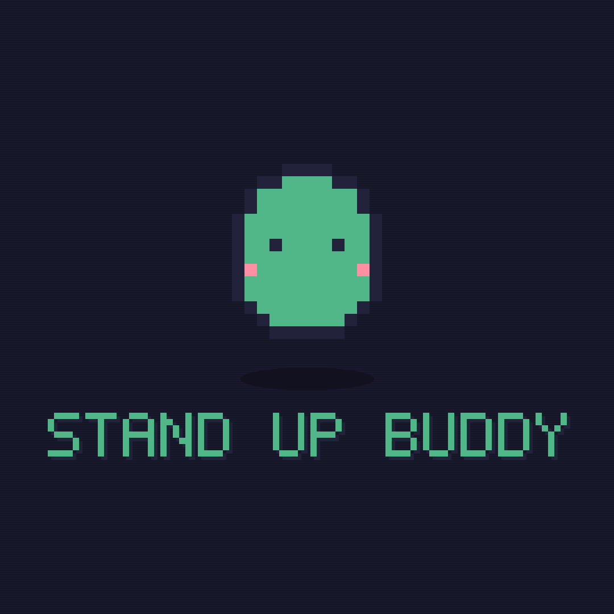

<p align="center">
  
</p>

# Stand Up Buddy

A whimsical retro pixel-art tray app that pops up every so often to remind you to stand up and stretch.


## Download

Grab the latest installer from the [Releases page](https://github.com/ebioweiii/stand-up-buddy/releases/latest):

- **macOS** — `Stand.Up.Buddy-x.y.z-universal.dmg` (Intel + Apple Silicon)
- **Windows** — `Stand.Up.Buddy.Setup.x.y.z.exe`

### First-launch warning (expected)

These builds aren't code-signed (that requires a paid Apple Developer ID / Windows certificate), so your OS will flag them as being from an unidentified developer the first time. This is normal, not a sign anything is broken.

- **macOS**: because the app isn't notarized, macOS blocks it on first launch — and on recent versions it may move it straight to the Trash rather than offer an "Open" option. The reliable fix is one Terminal command:
  1. Drag `Stand Up Buddy.app` from the disk image into your **Applications** folder.
  2. Open **Terminal** (Spotlight → type "Terminal"), paste the line below, and press Return. It'll ask for your Mac login password (typing is invisible — that's normal):

     ```bash
     sudo xattr -cr "/Applications/Stand Up Buddy.app" && sudo codesign --force --deep --sign - "/Applications/Stand Up Buddy.app"
     ```

  3. Open Stand Up Buddy from Applications as normal.

  This clears the quarantine flag macOS puts on downloaded apps and re-signs the app locally so it'll launch. (Only run commands like this for apps you trust.) The permanent fix that removes this step for everyone is Apple notarization, which requires a paid Apple Developer account.
- **Windows**: SmartScreen will show "Windows protected your PC". Click **More info**, then **Run anyway**.

## What it does

- Lives in the tray / menu bar — no dock icon, no clutter
- Every 30 minutes (configurable to 15/45/60), a small pixel-art buddy pops up in the corner of your screen with a short 8-bit blip
- **Standing! 🎉** switches to a waiting screen with a live "Standing for MM:SS" counter — the next countdown only starts once you click **I'm back**, not the moment you click Standing
- **5 more min** snoozes; the **–** button minimizes the popup without changing anything; **×** quits
- Pause/resume, mute, and change the interval from the tray menu
- Checks for updates automatically (and via **Check for Updates…** in the tray menu) — see the note below
- Settings persist locally between launches

### Auto-updates

The app checks GitHub Releases for newer versions on launch and periodically after that. On **Windows**, downloaded updates install automatically. On **macOS**, automatic install currently requires the app to be notarized with a real Apple Developer ID — since this build is only ad-hoc signed, update checks work but installing the downloaded update will likely fail with a signature error until notarization is set up. Until then, macOS users should grab new versions from the [Releases page](https://github.com/ebioweiii/stand-up-buddy/releases/latest) directly.

## Development

Requires Node.js 18+.

```bash
npm install
npm start
```

> **Apple Silicon note:** the plain npm `electron` binary is unsigned, so macOS may flag it as malware on first run and delete it. If that happens, re-run `npm install` and then ad-hoc sign it before starting:
> ```bash
> codesign --force --deep --sign - node_modules/electron/dist/Electron.app
> npm start
> ```

### Building installers locally

```bash
npm run dist:mac    # -> dist/*.dmg
npm run dist:win    # -> dist/*.exe (cross-build needs Wine on non-Windows, or run on Windows)
```

### Releasing

Pushing a tag like `v1.0.1` triggers [`.github/workflows/build.yml`](.github/workflows/build.yml), which builds both installers on GitHub-hosted runners and attaches them to a new GitHub Release automatically.

```bash
git tag v1.0.1
git push origin v1.0.1
```

## How the pixel art works

The character and tray icon aren't sprite-sheet images — they're generated procedurally at runtime from a circle/ellipse formula plus edge-detection (see [`src/trayIcon.js`](src/trayIcon.js) and [`src/popup/sprite.js`](src/popup/sprite.js)). The chiptune blip is likewise synthesized live with the Web Audio API rather than a bundled sound file.

## License

MIT
